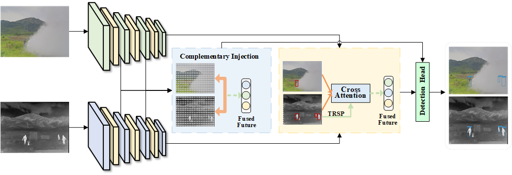
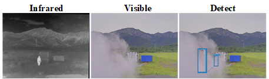

# TRiCF-Net
This repo is the official implementation for TRiCF-Net: A Thermal Radiation Perception
and Coordinate-Guided Cross-Modal Object Detection Network

# Overview
## Framework
<p align="center">
  
</p>

## Visualization
<p align="center">
  
</p>


# Installation
## Clone the repository
git clone [https://github.com/0aaaa0/TRiCF.git](https://github.com/0aaaa0/TRiCF.git)

cd TRiCF
## Create Environment
```shell
conda create -n TRiCF python=3.8
conda activate TRiCF
pip install -r requirements.txt
```
# Datasets 
## Datasets
"FLIR-aligned"  "VEDAI"   "M3FD"
Please download the datasets from the following links and place them in `data/multispectral/`

# Manual Training & Evaluation
## Training
```shell
python train.py --data data/multispectral/FLIR-align-3class.yaml 
```
## Evaluation
```shell
python test.py --data data/multispectral/FLIR-align-3class.yaml --weights best.pt
```
